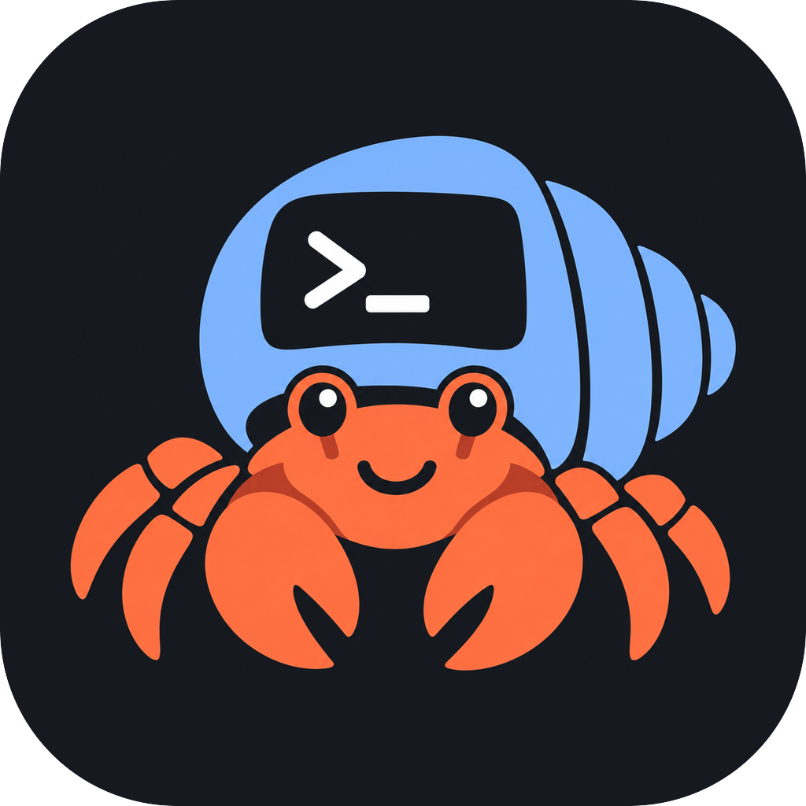
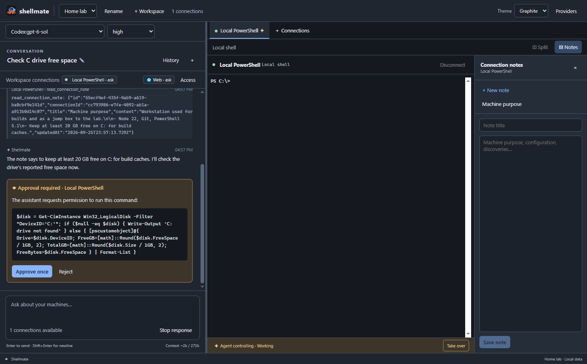

<p align="center">
  
</p>

<h1 align="center">Shellmate</h1>

<p align="center">
  An AI-assisted terminal and SSH connection manager for Windows.<br />
  Live terminals, an assistant you can watch, per-connection notes, and explicit permissions.
</p>

<p align="center">
  <a href="https://github.com/Dorely/Shellmate/releases/latest"></a>
  <a href="LICENSE"></a>
  <a href="https://buymeacoffee.com/dorely"></a>
</p>

Shellmate is free to use. If it saves you time, you can [buy Dorely a coffee](https://buymeacoffee.com/dorely).



Shellmate pairs visible local or SSH terminals with persistent assistant conversations. You decide which machines an assistant may use and how much it may do on them. Every command it runs is typed into a terminal you can see, and you can take over at any time.

## Download

Get the Windows installer (`Shellmate-Setup-<version>.exe`) from the [latest release](https://github.com/Dorely/Shellmate/releases/latest). Shellmate supports Windows 10 and 11 (x64).

The installer is not code-signed yet, so Windows SmartScreen may warn about an unrecognized app. Choose **More info → Run anyway** to continue. Each release lists a SHA-256 checksum next to the installer.

Your data stays on your machine in `%APPDATA%\Shellmate`: a SQLite database for workspaces, connections, notes, and conversations, plus OS-encrypted files for API keys, OAuth tokens, and SSH passwords. Uninstalling keeps this folder.

## Features

- **Workspaces** group shared connection profiles, conversations, and connection notes. Each workspace reopens its last active conversation after a restart.
- **Terminals:** local PTYs and SSH sessions with host-key verification, password or private-key authentication, terminal tabs, and a two-terminal split.
- **Providers:** sign in with a Codex account, or add Chat Completions, Responses, or Anthropic API providers. API keys and OAuth tokens use Electron's OS-backed encryption and never enter the database.
- **Access control:** each workspace connection is Disabled, Ask before commands, or Autonomous. A terminal the assistant is using is locked for that turn, and taking over stops further assistant commands.
- **Notes:** per-connection notes that both you and the assistant can read and write, so machine context is visible and editable instead of hidden memory.
- **Web access** per workspace (Disabled, Ask, Autonomous) for web search, page fetches, and clickable cited sources.
- **Long turns:** automatic context compaction between tool rounds. Older tool outputs are cleared (the assistant can reread them), then older history is summarized in the chat. API models have an editable context window (default 272,000 tokens).
- **Conversation history** lists conversations newest first; rename or delete them there. The assistant keeps titles short until you name a conversation yourself.
- Graphite, Light, and Forest themes.

## Control model

Every conversation sees its workspace's connection tabs, including disconnected connections it can reconnect. Each workspace connection defaults to **Ask before commands**; use **Access** to set Disabled or Autonomous. The selected terminal tab changes what you see; assistant tool calls always name a connection ID. New connections and permission increases take effect with the next message, while restrictions take effect immediately.

The main process holds exclusive ownership of a terminal while an assistant turn uses it. You can scroll and copy during that time; typing and competing assistant commands are rejected. **Take over** and stopping the turn both end assistant dispatch and interrupt the assistant's running command. If the program ignores the interrupt, control still returns to you after three seconds.

Assistant commands are typed into the live shell exactly as you would type them, so the working directory and variables persist. Shellmate learns prompt, command-start, and exit-code boundaries from invisible shell-integration sequences. Local PowerShell loads the hooks at launch. Local POSIX shells and SSH sessions receive a one-line bootstrap after connecting, with its echo hidden and, in bash, its history entry removed. Agent commands require PowerShell or a POSIX shell (bash, zsh, dash/sh) with integration ready. cmd.exe sessions are manual only. Password prompts from assistant commands open an app dialog showing the prompt text; Windows UAC elevation happens outside the terminal and is left to you.

Unknown or changed SSH host keys need explicit trust. Password prompts appear in a dedicated application dialog and are not sent to the model. An assistant command is watched for a short window (five seconds unless the assistant asks for longer); the assistant then sees the output so far and either waits or interrupts the command itself with Ctrl+C. Interrupted commands are not replayed on restart. A turn keeps calling tools until the assistant finishes or you stop it. If an assistant command ends the shell (for example `set -e` followed by a failure), the assistant is told the terminal disconnected and why.

## Web access

Each workspace has a **Web** setting under **Access**. New workspaces use **Ask before each search or fetch**.

- **Disabled:** the assistant has no web tools.
- **Ask:** each `web_search` and `web_fetch` call shows an approval card with the query or URL.
- **Autonomous:** web calls run without approval. Models with built-in search (Codex models, and API models whose test found hosted search) use the provider's search. Built-in search runs on the provider's servers and can't be approved per call, so it is offered only in Autonomous mode.

When built-in search isn't used, `web_search` goes through the search API chosen in **Providers → Web search**: SerpApi or Tavily. Enter the API key there; it is stored with OS encryption. Without a configured search API, the assistant can still fetch known URLs. `web_fetch` reads only public http(s) pages; loopback, private, link-local, and CGNAT addresses are blocked, including after redirects. URLs in chat open in the system browser, and cited sources are listed under the answer.

## Development

Requires Node.js 22 or later on Windows.

```powershell
npm ci
npm run typecheck
npm run dev
```

`npm ci` downloads the Electron runtime and rebuilds `better-sqlite3` for it. `node-pty` ships a Windows binary and is intentionally excluded from the rebuild, because its source build requires Spectre-mitigated C++ libraries. Native modules remain unpacked by electron-builder.

`npm run build` makes a production bundle and `npm run package` builds the Windows installer in `release/`. VS Code F5 starts the Electron development app. The app uses a loopback OAuth callback on port 1455 when signing in to Codex.

For browser verification, run `npm run browser` and open the printed `http://127.0.0.1:<port>` URL. This builds the renderer and starts the same local services without an Electron window. Stop it with Ctrl+C when finished, and re-run the command after code changes. Browser mode uses the existing Shellmate profile, so changes made there also appear in the desktop app.

The app icon is generated from `build/icon.png`; run `npm run icons` (requires ImageMagick 7) after changing it.

See [Releasing Shellmate](docs/releasing.md) for the release workflow, [CONTRIBUTING.md](CONTRIBUTING.md) before opening a pull request, and [architecture](docs/architecture.md) for runtime boundaries.

## License

Shellmate is open source under the [MIT License](LICENSE).
